# procgen-flow-matching

> Conditional Flow Matching for procedural generation of 2D tile-based game maps, framed as a constraint satisfaction problem.

This is the source code for Luiz Slongo's Computer Science Bachelor's thesis (TCC) at the Federal University of Santa Catarina (UFSC, Brazil), advised by Prof. Elder Rizzon Santos.

## About

The thesis applies **Conditional Flow Matching** (Lipman et al., 2023) to procedural map generation. A U-Net learns a velocity field over a one-hot tile-type space; an Euler ODE solver integrates this field from random noise to a valid map. The resulting model is evaluated by a **failure-mode classifier** that counts and categorizes structural constraint violations in generated chunks.

The approach replaces:
- **Manually-defined constraint rules** (as used by Wave Function Collapse) with **learned constraints** extracted implicitly from a dataset of real maps;
- **Slow iterative sampling** (as in Denoising Diffusion Probabilistic Models) with **fast Euler integration** of a learned vector field.

Training and evaluation use the **Video Game Level Corpus** (VGLC) Super Mario Bros levels as the dataset of valid maps.

## Architecture

```mermaid
flowchart LR
    A[VGLC .txt levels] --> B[VglcLevelParser]
    B --> C[TileMap]
    C --> D[TileMapChunker<br/>28x14 sliding window]
    D --> E[TileMapTensorConverter<br/>one-hot]
    E --> F["Tensor (N,14,14,28)"]
    F --> G[CFM training loop]
    G --> H[UnetBaseline checkpoint]

    I[Random noise] --> J[EulerOdeSolver<br/>NFE steps]
    H -.-> J
    J --> K[Generated tensor]
    K --> L[argmax + FromOneHotTensor]
    L --> M[Generated TileMap]
    M --> N[FailureModeAnalyzer]
    N --> O[Per-type violation counts]
```



The pipeline has two phases:
- **Training** (top row): VGLC levels become tensors; the CFM loss drives the U-Net to predict the velocity field from noise to data;
- **Inference** (bottom row): noise plus the trained checkpoint produces generated maps; the `FailureModeAnalyzer` quantifies the result.

## Repository Structure

The codebase uses a layered architecture with explicit dependency direction (`c1 → c2 → c3 → c4`). `c2` assemblies are domain libraries; `c4` assemblies are executables.

| Assembly | Layer | Role |
|---|---|---|
| `c2-pcg.flow-matching-dataloader` | c2 | VGLC parsing, chunking, one-hot tensor encoding |
| `c2-pcg.flow-matching-model` | c2 | U-Net building blocks (`SinusoidalTimeEmbedding`, `ResidualConvBlock`, `DownsampleBlock`, `UpsampleBlock`) and the `UnetBaseline` composition |
| `c2-pcg.flow-matching-training` | c2 | CFM loss computation and training loop |
| `c2-pcg.flow-matching-inference` | c2 | Euler ODE solver and `MapGenerator` |
| `c2-pcg.flow-matching-eval` | c2 | `FailureModeAnalyzer` with 6 categorized constraint checks |
| `c4-cmd.pcg-flow-matching` | c4 | End-to-end dataloader smoke-test CLI |
| `c4-cmd.pcg-flow-matching-train` | c4 | Training CLI (loads VGLC, trains, saves checkpoint) |
| `c4-cmd.pcg-flow-matching-generate` | c4 | Generation CLI (loads checkpoint, generates, evaluates) |
| `c4-test.pcg-flow-matching` | c4 | `FeatureTestRunner` with 102 assertions covering every assembly |

## Prerequisites

- [.NET 8 SDK](https://dotnet.microsoft.com/download/dotnet/8.0)
- A clone of [TheVGLC](https://github.com/TheVGLC/TheVGLC) somewhere on disk (not redistributed in this repo)
- Python 3.9+ with `Pillow`, `pandas`, and `matplotlib` (for sprite extraction and loss plotting). On Debian/Ubuntu, recent Python distributions are externally managed (PEP 668), so create a project-local virtual environment:
  ```bash
  python3 -m venv .venv
  source .venv/bin/activate
  pip install pillow pandas matplotlib
  ```
  Re-activate the venv (`source .venv/bin/activate`) at the start of every shell session that uses the Python scripts.

TorchSharp `0.105.1` and SixLabors.ImageSharp `3.1.12` are pinned via `Directory.Packages.props` and resolve during `dotnet restore`. CUDA selection on Windows/Linux is automatic based on `Directory.Build.props`; falls back to CPU.

## Build

```bash
dotnet build procgen-flow-matching.sln
```

Expected: `0 Error(s)`.

## Run

Throughout the examples below, replace `<vglc>` with the local path to your VGLC Super Mario Bros `Processed` directory, for example:
`/path/to/TheVGLC/Super Mario Bros/Processed`.

### Run the test suite (102 assertions)

```bash
dotnet run --project c4-test.pcg-flow-matching -- "<vglc>"
```

Expected: `RESULTS: 102 passed, 0 failed, 102 total`.

### Train a model

Iteration 1 baseline hyperparameters are hardcoded in `PcgFlowMatchingTrainEntryPoint.cs`: learning rate `5e-5`, batch size `32`, `2000` steps, base channels `64`, time embedding dim `128`, gradient clip `0.5`, seed `42`.

```bash
dotnet run --project c4-cmd.pcg-flow-matching-train -- "<vglc>"
```

Produces:
- `unet-baseline-checkpoint.bin` — final model weights;
- `unet-baseline-checkpoint.bin.step{500,1000,1500}` — periodic checkpoints;
- `loss-log.csv` — per-step training loss.

### Plot the training loss curve (optional)

```bash
python scripts/plot-loss-curve.py loss-log.csv loss-curve.png
```

Produces an annotated PNG showing the loss trajectory with initial and final values highlighted.

### Extract Mario tile sprites from VGLC (one-time setup)

The PNG renderer used by the generate command needs one 16x16 sprite per tile type. These are derived from the VGLC Super Mario Bros level screenshots and are **not committed to this repo** (they are NES-game graphics belonging to Nintendo; we use them solely for academic evaluation per fair-use). Generate them locally with:

```bash
python scripts/extract-sprites.py "<vglc>/.." sprites
```

Here `<vglc>/..` is the parent of the VGLC `Processed` directory, i.e. the `Super Mario Bros` directory itself (containing both `Processed/` and `Original/`). The script writes `sprites/Solid.png`, `sprites/Coin.png`, etc. — one file per TileType enum value.

### Generate chunks and evaluate

```bash
dotnet run --project c4-cmd.pcg-flow-matching-generate -- unet-baseline-checkpoint.bin
```

Produces:
- 10 ASCII-rendered generated chunks printed to stdout
- Per-type violation counts from the `FailureModeAnalyzer`
- 10 PNG files in `./generated-png/` (`chunk-001.png` to `chunk-010.png`) at 16×16 px per tile, using the sprites in `./sprites/`

Flags:
- `--no-render-png` — skip PNG output (ASCII + analysis only)
- `--png-dir <path>` — override the PNG output directory
- `--sprite-dir <path>` — override the sprite source directory

If the sprite directory is missing the command prints a warning and continues with ASCII output only.

## Results

The Iteration 1 baseline (2000 training steps on CPU, single seed) drops the loss from **1.08 to 0.14** and produces generated chunks with an average of **7.7 violations per chunk**. The dominant failure mode is **discontinuous ground** (60% of all violations).

The full report for Iteration 1 is in [`docs/260529.tcc-iteration-1-first-end-to-end-result.txt`](docs/260529.tcc-iteration-1-first-end-to-end-result.txt). Earlier progress reports and the Iteration 1 implementation plan live in [`docs/`](docs/).

## Citation

If you reference this work, please cite the thesis:

```bibtex
@thesis{slongo2026procgen,
  author      = {Luiz Gabriel Slongo},
  title       = {Procedural Generation of Game Maps as a Constraint Satisfaction Problem: An Euler-based Conditional Flow Matching Approach},
  type        = {Bachelor's Thesis},
  institution = {Universidade Federal de Santa Catarina (UFSC)},
  year        = {2026},
  url         = {https://github.com/luizslongo/procgen-flow-matching}
}
```

## License

To be decided. MIT is suggested for open scientific reuse.

## Acknowledgements

- Prof. Elder Rizzon Santos (UFSC) for advising the thesis;
- Brandon Joseph Smietana for helping come up with this idea;
- The Iosys team for GPU infrastructure access (devbox with 3× RTX 3090 Ti).
